# Hi, I'm Anmol Agarwal

## About me

- **Competitive Programmer in C++** — I'm on [Codeforces](https://codeforces.com/profile/i_anmolagarwal) and [CodeChef](https://www.codechef.com/users/i_anmolagarwal) as `i_anmolagarwal`.
- **AI agents that are mostly deterministic code around one model call** — [damage-claim-agent](https://github.com/iAnmolAgarwal/damage-claim-agent) verifies damage claims from photos with a vision-language model behind a rule layer and a structural prompt-injection defence; [whatsapp-notification-router](https://github.com/iAnmolAgarwal/whatsapp-notification-router) routes messages to notify / digest / mute across text, image and voice. Both were solo HackerRank Orchestrate submissions that placed **global #63**.
- **Python systems where correctness matters** — [orb-trader](https://github.com/iAnmolAgarwal/orb-trader), a crash-safe Opening Range Breakout paper-trader for NSE options via Zerodha Kite (software brackets, crash reconciliation, hard risk limits), and [skywatch](https://github.com/iAnmolAgarwal/skywatch), real-time threat detection on ADS-B telemetry with a hybrid rule + ML pipeline and deterministic incident replay.
- **Hardware and graphics on the side** — [smart-e-nose](https://github.com/iAnmolAgarwal/smart-e-nose), an ESP32 electronic nose for food-spoilage detection with cloud telemetry, and [thwip](https://github.com/iAnmolAgarwal/thwip), a first-person web-swinging game in a procedurally generated comic city built with Three.js — zero assets, everything generated at runtime.

## Currently building

**Pathwise** — an AI-powered personalised learning-path recommender, my entry for the AMPLIfied hackathon.

## Tech stack

## GitHub stats

## Contact

