> The full session — typed prompt, spinner, `/projects`, `/stats`, the lot — runs at **[portfolio-cli-eta.vercel.app](https://portfolio-cli-eta.vercel.app)**.

## projects `/projects`

- **`Read(orb-trader)`** — crash-safe NSE intraday opening-range-breakout system for Zerodha Kite: software-managed brackets, atomic state, crash reconciliation, −3% kill-switch. Paper-trading only, no profit claims. 194 tests, written first. → [orb-trader](https://github.com/iAnmolAgarwal/orb-trader)
- **`Read(damage-claim-agent)`** — vision-language agent that verifies damage claims from photos; perception stays blind to user history, the verdict lives in deterministic code, and a structural prompt-injection defence means an adversarial image can only degrade to *not enough information*. Solo, HackerRank Orchestrate — global #63 of 1,773. → [damage-claim-agent](https://github.com/iAnmolAgarwal/damage-claim-agent)
- **`Read(whatsapp-notification-router)`** — routes each incoming message to notify / digest / mute, personalised to the recipient, over text, image posters and voice notes; one model call wrapped in deterministic Python, every claim measured against its own noise floor. Solo, HackerRank Orchestrate — global #63 of 1,983. → [whatsapp-notification-router](https://github.com/iAnmolAgarwal/whatsapp-notification-router)
- **`Read(smart-e-nose)`** — ~$24 ESP32 electronic nose for food-spoilage detection: four-sensor MQ array, five-state firmware, Blynk + ThingSpeak + Telegram in parallel. Manuscript under review at *Sensors and Actuators Reports*. → [smart-e-nose](https://github.com/iAnmolAgarwal/smart-e-nose)
- **`Read(pathwise)`** — AI-powered personalised learning-path recommender: a deterministic knowledge-graph + embedding engine decides what to learn and in what order; a Claude-API mentor explains each recommendation from the engine's own evidence. In progress for a judged hackathon — repo private until submission.

## experience `/experience`

- **Jun – Jul 2026 · Summer Intern, Bharat Space Education Research Centre (BSERC)** — 6-week applied space-technology program (generative AI, cybersecurity & digital forensics, UAV systems). Capstone: [skywatch](https://github.com/iAnmolAgarwal/skywatch), a real-time flight-telemetry pipeline on the live ADS-B feed with crash-safe atomic state, a hard alert-triage gate and deterministic incident replay — 79 tests, ~2,780 lines of Python.
- **B.Tech CSE, Jaypee Institute of Information Technology, Noida** — expected May 2028 · CGPA 8.5/10.

## competitive programming `/cp`

Codeforces Pupil (max 1362) · CodeChef 2★ (max 1565) · 242-day solving streak · 3,000+ problems · IICPC global #2,155 · BVCOE Coding Cup top 8 — as [`i_anmolagarwal`](https://codeforces.com/profile/i_anmolagarwal) on [CodeForces](https://codeforces.com/profile/i_anmolagarwal) and [CodeChef](https://www.codechef.com/users/i_anmolagarwal).

## stack `/stack`

## stats `/stats`

## contact `/contact`

[github.com/iAnmolAgarwal](https://github.com/iAnmolAgarwal) · [linkedin.com/in/anmolagarwal26](https://www.linkedin.com/in/anmolagarwal26) · [anmolagarwal2625+github@gmail.com](mailto:anmolagarwal2625+github@gmail.com) · [codeforces](https://codeforces.com/profile/i_anmolagarwal) · [codechef](https://www.codechef.com/users/i_anmolagarwal) · [portfolio](https://portfolio-cli-eta.vercel.app)

✻ Worked for 3s · ※ recap: builds things that must not fail silently. <b>open to internships (summer 2027)</b>.
